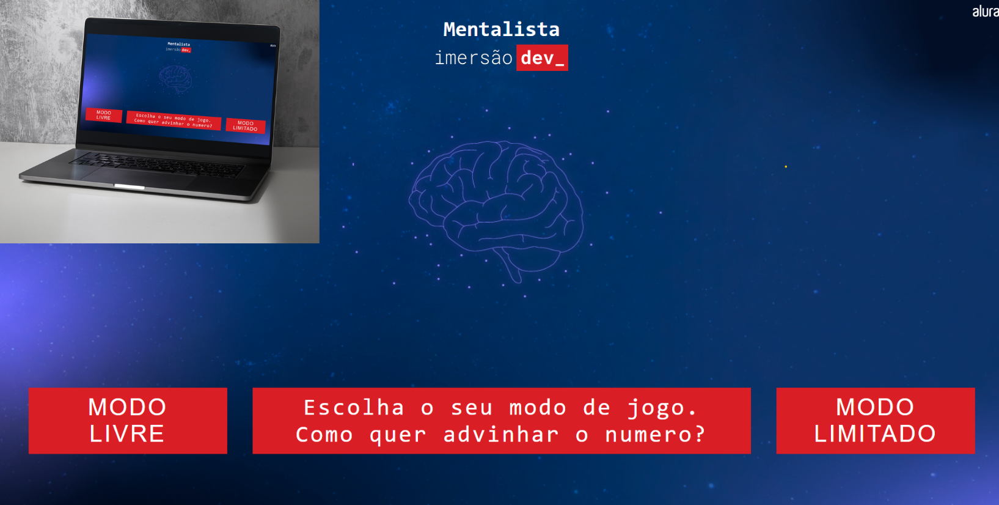

<h1 align="center"> Mentalista, descubra o numero</h1>

Projeto de jogo de avinhação de um numero gerado pela máquina durante as aulas gratuitas da <a href="https://www.alura.com.br/">Alura  

  <a href="#-tecnologias">Tecnologias</a>&nbsp;&nbsp;&nbsp;|&nbsp;&nbsp;&nbsp;
  <a href="#-projeto">Projeto</a>&nbsp;&nbsp;&nbsp;|&nbsp;&nbsp;&nbsp;
  <a href="#-layout">Comentários</a>&nbsp;&nbsp;&nbsp;&nbsp;&nbsp;&nbsp;

 
<h2 align="center">Projeto:</h2>

  

## 🚀 Tecnologias

Esse projeto foi desenvolvido com as seguintes tecnologias:

- HTML e CSS
- JavaScript
- Git e Github

## 💻 Projeto

Jogo para descobrir um numero aleatório gerado pela maquina. São dois modos adaptados por mim. Advinhe livremente ou escolha quantas chances você terá.

- [Visite o projeto online](https://diegoweb3r.github.io/guessthenumber/)

## :book: Comentários
O desafio do projeto foi JavaScript. Nao tinha tido contato com a linguagem e o projeto trás algoritmos e metodos que eu nao conhecia.

Feito por Diego Web3r
